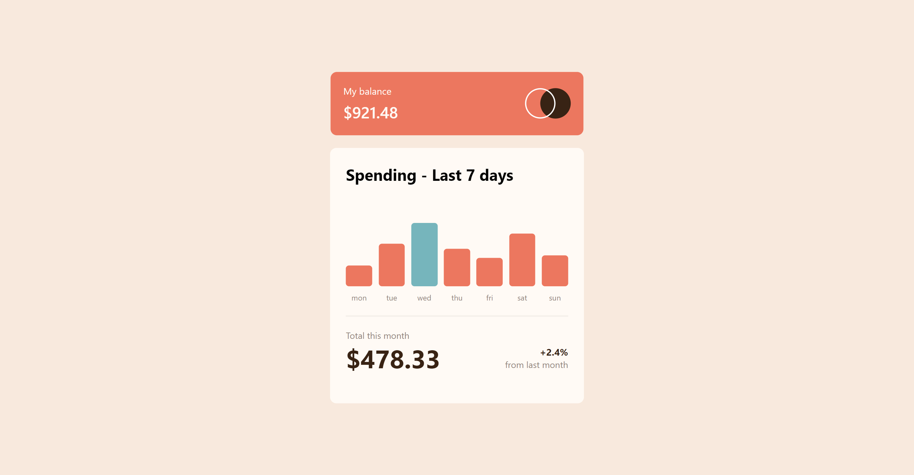
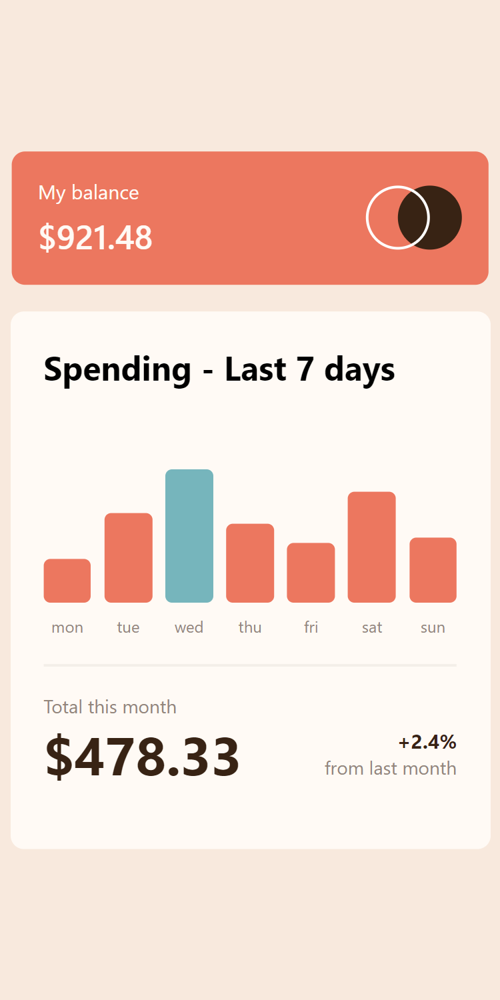

# Frontend Mentor - Expenses chart component solution

This is a solution to the [Expenses chart component challenge on Frontend Mentor](https://www.frontendmentor.io/challenges/expenses-chart-component-e7yJBUdjwt). Frontend Mentor challenges help you improve your coding skills by building realistic projects.

## Table of contents

- [Overview](#overview)
  - [The challenge](#the-challenge)
  - [Screenshot](#screenshot)
  - [Links](#links)
- [My process](#my-process)
  - [Built with](#built-with)
  - [What I learned](#what-i-learned)
  - [Continued development](#continued-development)
  - [Useful resources](#useful-resources)
- [Author](#author)
- [Acknowledgments](#acknowledgments)

## Overview

### The challenge

Users should be able to:

- View the bar chart and hover over the individual bars to see the correct amounts for each day
- See the current day’s bar highlighted in a different colour to the other bars
- View the optimal layout for the content depending on their device’s screen size
- See hover states for all interactive elements on the page
- **Bonus**: Use the JSON data file provided to dynamically size the bars on the chart

### Screenshot




### Links

- Solution URL: [Solution URL here](https://github.com/Memeena/expenses-chart-component-main/tree/master)
- Live Site URL: [Live site URL here](https://memeena.github.io/expenses-chart-component-main/)

## My process

### Built with

- Semantic HTML5 markup
- CSS custom properties
- Flexbox
- CSS Grid
- Desktop-first workflow
- [React](https://reactjs.org/) - JS library
- [CSS Modules] - For styles

### What I learned

This is my first React Challenge and I have used the following features of React.

- useState
- Dynamic styling
- Handling events
- Sending values through props to child component

```js
//To determine the height of each bar based on the maximum amount, dynamically from the data.json file
let barFillHeight =
  props.maxValue > 0
    ? Math.round((props.amount / props.maxValue) * 100) + "px"
    : "0%";

//Dynamic styling for background color of each bar
const dynamicStyle = {
  backgroundColor: props.amount === props.maxValue ? bgMaxHover : bgHover,
};
```

### Continued development

Shall learn more React concepts like useEffect, custom hooks and better state management with Redux.

### Useful resources

- [Scrimba - Learn React for free](https://scrimba.com/learn/learnreact) - This course gave me the confidence in doing this challenge.
- [Udemy - React course by Maximillian Schwarzmuller](https://www.udemy.com/course/react-the-complete-guide-incl-redux)

## Author

- Frontend Mentor - [@meMeena](https://www.frontendmentor.io/profile/meMeena)
- Twitter - [@Mekrish18](https://www.twitter.com/MeKrish18)
